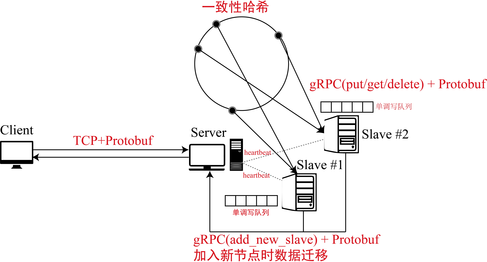

# DKVDB
分布式键值系统的一个实现

## 相关理论技术

### M/S结构
这里使用的是主从的分布式结构，主节点处理客户端请求，并把相应的请求转发到从节点上，得到结果再发送回给客户端。

### CAP
这个实现只满足CAP中CP，更具体而言，实现里没有关于数据的备份，因此节点down了数据就可能丢失了。

### RPC
RPC，又称为远程过程调用（Remote Procedure Call），第三方的客户程序可以通过 RPC 运行一些定义在其他程序或计算机进程的黑盒函数，并获得函数返回的数据。换言之，RPC 框架可以使用户更方便地在分布式系统中调用远程服务，被调用的服务在其他联网的计算机上执行，并返回结果。

这里使用了Google的gRPC框架，利用ProtoBuffer作为接口描述语言，使用的是一元RPC服务。

### 一致性哈希
使用字符串哈希算法，将每个服务器映射为多个虚拟节点，然后维护一个有序数组，每次请求都使用二分查找在这个数组上查询大于等于请求哈希值的第一个服务器，将数据存储在服务器上。

### 单调写一致性
这是一种最终一致性的方法，实现只保证put操作是按顺序执行的。具体的实现是，每个节点都维护一个写队列，每次put请求不马上执行，而是将请求放入队列中，节点从队列中按顺序取出写请求然后执行返回。

### 网络通信
client到master使用socket的TCP通信，master维护一个线程池，把每次请求丢给一个线程处理，然后继续监听；master到slave使用gRPC通信。

### 数据迁移
每次有新的slave加入时，需要计算出它覆盖了原本一致性哈希环上的哪些区间，将这些区间发送给对应的slave，把它们区间内的数据打包发送给新slave。当数据完成迁移的时候新slave才能执行其他操作。注意，数据迁移是一个原子操作，此时不能执行任何put操作，但是可以执行get操作。

### 系统结构


## 环境配置（请使用python3.7）
```
conda install numpy
conda install protobuf
conda install grpcio
conda install grpcio-tools
conda install -c conda-forge python-lmdb
```

## 代码生成
运行下面代码生成grpc服务的python代码，并自己添加`__init__.py`文件。
```
python -m grpc_tools.protoc -I=./protos --python_out=./rpc_package --grpc_python_out=./rpc_package ./protos/rpc_package.proto
```
修改`rpc_package_pb2_grpc.py`头文件引用
```
import rpc_package_pb2 as rpc__package__pb2
```
为
```
import rpc_package.rpc_package_pb2 as rpc__package__pb2
```

运行下面代码生成tcp通讯中使用的protobuf结构
```
protoc -I=./protos --python_out=./ ./protos/tcp_protobuf.proto
```

## 代码说明
`Requset`结构体中包含2个成员变量`key`和`value`，就是键值数据库中的键值，类型都是字符串。`Response`结构体中包含2个成员变量`message`和`value`，分别表示client请求操作的执行结果，以及操作的返回值，类型都是字符串。`TransFrom`结构体提供4个成员变量`start`， `end`，`aim_ip`和`aim_port`，要传送的key的哈希的范围为start-end，目标slave的ip和port。`BackUp`有2个成员变量，`keys`和`values`，用来存储数据迁移时的键值。grpc服务`Datastore`提供5种操作：`put`，`get`，`delete`，`receive`和`transform`。后两者用于数据迁移，receive用于接受大量的key和value，transform用于server告诉某个slave要将哪些哈希范围的数据传给新的slave，让这个slave自己调用新slave的receive服务。grpc服务`Slave`提供1种操作`add_slave_setting`，用于slave定时向server发送信息，还有新slave入网。

## 代码运行
```
python server.py
python slave.py --port 8002
python slave.py --port 8003
pythpn client.py
```